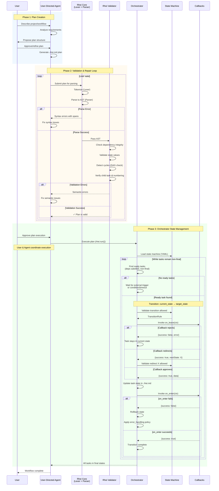

# AR-agent-orchestrator-workflow: Agent-Orchestrator Workflow Architecture

This document describes how a user-directed agent creates a Rhei plan, validates
and fixes syntax, and passes it to the orchestrator for state-managed execution.
It expands the plan language, state machine, transition, and run-command
contracts into the component workflow they imply. §FS-rhei-plan-language
§FS-rhei-states §FS-rhei-transitions §FS-rhei-run

## 1. High-Level Architecture

```
┌─────────────────────────────────────────────────────────────────────────────────────┐
│                              USER-DIRECTED AGENT                                     │
│  ┌─────────────┐    ┌──────────────────┐    ┌──────────────────┐                   │
│  │   User      │───▶│  Agent (e.g.,    │───▶│  Generate Rhei   │                   │
│  │   Request   │    │  Claude/Kilo)    │    │  Plan (.rhei.md) │                   │
│  └─────────────┘    └──────────────────┘    └────────┬─────────┘                   │
└────────────────────────────────────────────────────────┼───────────────────────────┘
                                                         │
                                                         ▼
┌─────────────────────────────────────────────────────────────────────────────────────┐
│                           SYNTAX VALIDATION & REPAIR LOOP                           │
│                                                                                     │
│  ┌──────────────┐    ┌──────────────────┐    ┌──────────────────┐                  │
│  │  rhei-core   │───▶│  rhei-validator  │───▶│  Validation      │                  │
│  │  (Lexer +    │    │  (Semantic       │    │  Result          │                  │
│  │   Parser)    │    │   Checks)        │    │                  │                  │
│  └──────────────┘    └──────────────────┘    └────────┬─────────┘                  │
│         ▲                                             │                            │
│         │            ┌──────────────────┐             │                            │
│         └────────────│  Agent Fixes     │◀────────────┘                            │
│           (if errors)│  Syntax Errors   │    (errors returned)                     │
│                      └──────────────────┘                                          │
└────────────────────────────────────────────────────────────────────────────────────┘
                                                         │
                                                         │ (valid AST)
                                                         ▼
┌─────────────────────────────────────────────────────────────────────────────────────┐
│                               ORCHESTRATOR ENGINE                                    │
│                                                                                     │
│  ┌──────────────────────────────────────────────────────────────────────────────┐  │
│  │                         State Machine (YAML)                                  │  │
│  │  ┌─────────┐    ┌─────────────┐    ┌─────────┐    ┌───────────┐              │  │
│  │  │ pending │───▶│ in-progress │───▶│ review  │───▶│ completed │              │  │
│  │  └─────────┘    └─────────────┘    └─────────┘    └───────────┘              │  │
│  └──────────────────────────────────────────────────────────────────────────────┘  │
│                                                                                     │
│  ┌──────────────────────────────────────────────────────────────────────────────┐  │
│  │                    Transition Management                                      │  │
│  │                                                                               │  │
│  │   1. Find ready tasks (dependencies satisfied)                               │  │
│  │   2. Trigger on_leave callback                                               │  │
│  │   3. Update task state in .rhei.md                                           │  │
│  │   4. Trigger on_enter callback                                               │  │
│  │   5. Handle callback results (success/redirect/reject)                       │  │
│  │   6. Loop until all tasks reach final states                                 │  │
│  │                                                                               │  │
│  └──────────────────────────────────────────────────────────────────────────────┘  │
└─────────────────────────────────────────────────────────────────────────────────────┘
```

---

## 2. Detailed Sequence Diagram



---

## 3. Component Responsibilities

### 3.1. User-Directed Agent

The agent (e.g., a coding assistant like Claude) interprets user intent and generates structured plans:

| Responsibility | Description |
|----------------|-------------|
| **Interpret Requirements** | Understand user's project goals and constraints |
| **Generate Plan** | Create a `.rhei.md` file following the [Plan Language Specification](../functional-spec/rhei-plan-language.spec.md) |
| **Fix Errors** | Iteratively correct syntax and semantic errors until validation passes |
| **Monitor Progress** | Track task completion and adjust plans as needed |

### 3.2. Validation Pipeline

The validation pipeline ensures plan correctness before execution:

```
┌─────────────────────────────────────────────────────────────────┐
│                      rhei-core                                   │
├─────────────────────────────────────────────────────────────────┤
│  Lexer (lexer.rs)                                               │
│  ├── Tokenizes markdown into structured tokens                  │
│  ├── Identifies: RheiHeader, TaskHeader, MetadataState, etc.   │
│  └── Produces token stream with span information                │
│                                                                  │
│  Parser (parser.rs)                                              │
│  ├── Consumes token stream                                       │
│  ├── Builds AST (Plan → recursive Task tree)                    │
│  └── Reports parse errors with line/column info                 │
└─────────────────────────────────────────────────────────────────┘
                              │
                              ▼
┌─────────────────────────────────────────────────────────────────┐
│                    rhei-validator                                │
├─────────────────────────────────────────────────────────────────┤
│  Semantic Checks:                                                │
│  ├── Dependency integrity (all Prior refs exist)                │
│  ├── State validity (states match states.yaml)                  │
│  ├── Acyclic check (DAG via topological sort)                   │
│  └── Child task ids (Task N.M under Task N; depth ≤ maxLevels)  │
└─────────────────────────────────────────────────────────────────┘
```

### 3.3. Orchestrator Engine

The orchestrator manages workflow execution through state transitions:

```
┌─────────────────────────────────────────────────────────────────┐
│                    Orchestrator Engine                           │
├─────────────────────────────────────────────────────────────────┤
│                                                                  │
│  ┌──────────────────┐    ┌──────────────────┐                   │
│  │  Task Scheduler  │    │  State Machine   │                   │
│  │                  │    │                  │                   │
│  │ • Find ready     │◀──▶│ • Load YAML      │                   │
│  │   tasks          │    │ • Validate       │                   │
│  │ • Check deps     │    │   transitions    │                   │
│  │ • Queue work     │    │ • Track states   │                   │
│  └──────────────────┘    └──────────────────┘                   │
│           │                       │                              │
│           ▼                       ▼                              │
│  ┌──────────────────────────────────────────────────────┐       │
│  │              Transition Executor                      │       │
│  │                                                       │       │
│  │  1. on_leave(ctx) → validate exit from current       │       │
│  │  2. Update .rhei.md file with new state              │       │
│  │  3. on_enter(ctx) → initialize in new state          │       │
│  │  4. Handle: success / redirect / rejection / error   │       │
│  └──────────────────────────────────────────────────────┘       │
│                              │                                   │
│                              ▼                                   │
│  ┌──────────────────────────────────────────────────────┐       │
│  │              Callback Dispatcher                      │       │
│  │                                                       │       │
│  │  Platform-specific invocation:                        │       │
│  │  • CLI:     bash functions (stdin/stdout JSON)       │       │
│  │  • Node.js: NAPI native callbacks                    │       │
│  │  • Python:  PyO3 bindings                            │       │
│  │  • Java:    JNI method calls                         │       │
│  └──────────────────────────────────────────────────────┘       │
│                                                                  │
└─────────────────────────────────────────────────────────────────┘
```

---

## 4. State Transition Flow

The orchestrator advances tasks through states based on the state machine definition:

```
                          ┌─────────────────────────────────────┐
                          │         State Machine YAML          │
                          │                                     │
                          │  states:                            │
                          │    pending:     {}                  │
                          │    in-progress: {}                  │
                          │    review:      {}                  │
                          │    completed:   {final: true}       │
                          │                                     │
                          │  transitions:                       │
                          │    - from: pending                  │
                          │      to: in-progress               │
                          │      on_leave: validate_deps       │
                          │      on_enter: start_work          │
                          │    ...                              │
                          │                                     │
                          │  profiles:                          │
                          │    default:                         │
                          │      initial: pending               │
                          │      allowed: [pending,             │
                          │        in-progress, review,         │
                          │        completed]                   │
                          │  node_policy:                       │
                          │    root: default                    │
                          │    default: default                 │
                          └───────────────┬─────────────────────┘
                                          │
                                          ▼
    ┌─────────────────────────────────────────────────────────────────────┐
    │                    Task Lifecycle Example                            │
    │                                                                      │
    │   Task 2: Implement Feature                                          │
    │   **Prior:** Task 1                                                  │
    │                                                                      │
    │   ┌─────────┐  deps met   ┌─────────────┐  work done  ┌─────────┐   │
    │   │ pending │────────────▶│ in-progress │────────────▶│ review  │   │
    │   └─────────┘             └─────────────┘             └────┬────┘   │
    │        │                                                   │        │
    │        │                                       ┌───────────┴───┐    │
    │        │                                       │               │    │
    │        ▼                                  approved        changes   │
    │   Waiting for                                  │          needed    │
    │   Task 1 to                                    ▼               │    │
    │   complete                              ┌───────────┐          │    │
    │                                         │ completed │          │    │
    │                                         └───────────┘          │    │
    │                                                                │    │
    │                                         ◀──────────────────────┘    │
    │                                         (back to in-progress)       │
    └─────────────────────────────────────────────────────────────────────┘
```

---

## 5. Trigger Types

The orchestrator responds to different trigger sources:

| Trigger | `triggeredBy` | Description |
|---------|---------------|-------------|
| **User** | `'user'` | Explicit API call (CLI command, programmatic transition) |
| **Callback** | `'callback'` | Callback returns `nextState` override |
| **System** | `'system'` | Condition met or timeout elapsed |
| **Engine** | `'engine'` | Orchestrator auto-advances ready tasks during `rhei.run()` |

---

## 6. Error Handling

```
┌─────────────────────────────────────────────────────────────────┐
│                     Error Scenarios                              │
├─────────────────────────────────────────────────────────────────┤
│                                                                  │
│  on_leave Rejection (success: false)                            │
│  ┌──────────────────────────────────────────────────────────┐   │
│  │  • Task remains in current state                          │   │
│  │  • Error message logged/returned                          │   │
│  │  • No state file modification                             │   │
│  └──────────────────────────────────────────────────────────┘   │
│                                                                  │
│  on_enter Failure                                                │
│  ┌──────────────────────────────────────────────────────────┐   │
│  │  1. State is rolled back to original                      │   │
│  │  2. error_handling.on_enter_failure policy applied        │   │
│  │  3. May trigger transition to 'retrying' state            │   │
│  └──────────────────────────────────────────────────────────┘   │
│                                                                  │
│  Invalid Redirect                                                │
│  ┌──────────────────────────────────────────────────────────┐   │
│  │  • Callback returns nextState not in state machine        │   │
│  │  • TransitionForbiddenError raised                        │   │
│  │  • Task remains in current state                          │   │
│  └──────────────────────────────────────────────────────────┘   │
│                                                                  │
└─────────────────────────────────────────────────────────────────┘
```

---

## Summary

1. **Agent Creates Plan**: User-directed agent generates a `.rhei.md` file with hierarchical tasks
2. **Validation Loop**: Rhei lexer/parser and validator check syntax and semantics; agent fixes any errors
3. **Orchestrator Executes**: Once valid, the orchestrator loads the state machine and manages transitions
4. **State Progression**: Tasks advance through states via callbacks (`on_leave` → state update → `on_enter`)
5. **Completion**: Workflow finishes when all tasks reach final states (`completed`, `cancelled`, etc.)

## Related Documentation

- [Plan Language Specification](../functional-spec/rhei-plan-language.spec.md) — Formal EBNF grammar
- [States Specification](../functional-spec/rhei-states.spec.md) — State machine format and default states
- [Transitions Specification](../functional-spec/rhei-transitions.spec.md) — Advanced state machine with callbacks
- [Run Specification](../functional-spec/rhei-run.spec.md) — Orchestrated execution loop
- [Overview](overview.md) — Project architecture and crate responsibilities
