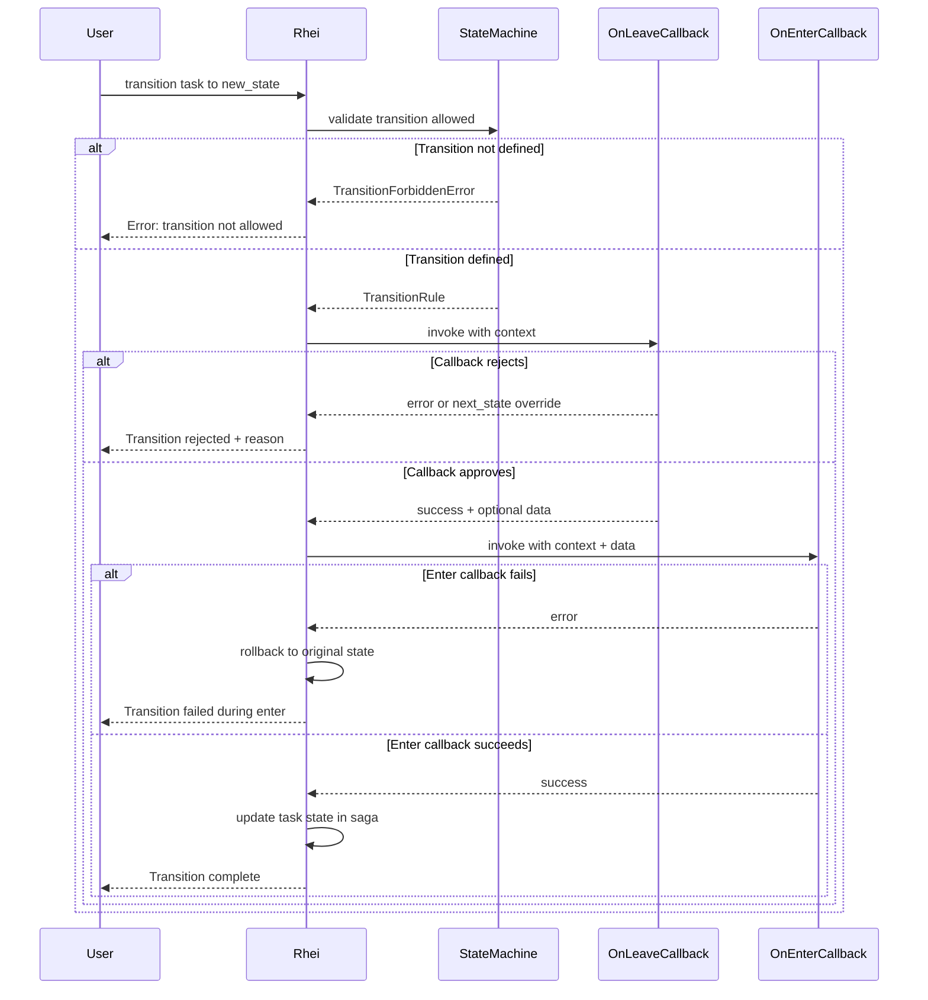

# Saga: Define Formal State Transition System for Sagas

Enhance the Rhei plan system to support **formal state transitions** with associated function callbacks.

State transitions will be defined declaratively in YAML and executed through platform-specific mechanisms:
- **CLI**: Bash function calls
- **JavaScript**: Native callbacks via NAPI to javascript functions.
- **Python**: Native callbacks via PyO3 bindings to python functions
- **Java**: Calls to Java functions with JNI

### Goals

1. Define state transition rules in YAML that specify valid `from -> to` state changes
2. Associate each transition with a function identifier that gets invoked:
  1. entering the state has one call
  2. leaving the state has another call that returns what is the next state
3. Provide a consistent API across CLI, JavaScript, Python, and Java

### Requirements
- State transitions must be explicitly declared - unlisted transitions are forbidden
- Transitions trigger callbacks/functions that receive context about the task
- Callbacks can reject transitions by returning an error (for conditional logic)
- Failed transitions should be reportable and recoverable
- All callbacks must be verified when transitioning states

---

## TransitionContext Data Structure

The `TransitionContext` is the core data structure passed to all transition callbacks. It provides complete context about the saga, the transitioning task, and the execution environment.

```typescript
/** A subtask within a task */
interface Subtask {
  id: string | number;
  title: string;
  content: string;
}

/**
 * Metadata associated with a task.
 *
 * Note: `state` and `dependsOn` (prior) are always present as implicit fields
 * and don't need to be declared in the metadata section.
 *
 * Custom metadata (like retryCount, priority, etc.) is stored in the YAML
 * metadata section of the saga file and is available here.
 */
interface TaskMetadata {
  /** Current state of the task - always present, managed by Rhei */
  state: string;
  /** Task dependencies (prior tasks) - always present */
  dependsOn: Array<string | number>;
  /** Custom metadata fields - any additional key-value pairs from YAML */
  [key: string]: any;
}

/** A task being transitioned within the saga */
interface Task {
  id: string | number;
  title: string;
  metadata: TaskMetadata;
  subtasks: Subtask[];
}

/** The saga containing the transitioning task */
interface Saga {
  title: string;
  /** Path to the plan file, e.g. [`scratchpad/formal-state-transitions.md`](scratchpad/formal-state-transitions.md) */
  path: string;
  tasks: Task[];
}

/** Details about the state transition being performed */
interface TransitionInfo {
  from: string;
  to: string;
  triggeredBy: 'user' | 'callback' | 'system';
  timestamp: string;  // ISO 8601 format (e.g., "2024-01-15T10:30:00Z")
}

/** Execution environment information */
interface Environment {
  platform: 'cli' | 'nodejs' | 'python' | 'java';
  version: string;
  workingDirectory: string;
}

/**
 * The context object passed to all transition callbacks.
 *
 * This provides complete information about:
 * - The saga being executed
 * - The specific task transitioning between states
 * - Details about the transition itself
 * - Data accumulated during this transition
 * - The execution environment
 */
interface TransitionContext {
  /** The saga being executed */
  saga: Saga;

  /** The specific task transitioning */
  task: Task;

  /** Transition details */
  transition: TransitionInfo;

  /** Data accumulated during this transition (from on_leave to on_enter) */
  transitionData: Record<string, any>;

  /** Execution environment */
  environment: Environment;
}

/**
 * The result returned from transition callbacks.
 *
 * Callbacks use this to indicate success/failure and optionally
 * override the target state or pass data to subsequent callbacks.
 */
interface TransitionResult {
  success: boolean;
  error?: string;
  nextState?: string;  // Override: redirect to different state
  data?: Record<string, any>;
}
```

### Usage Example

```typescript
rhei.onLeave('pending', 'processing', async (ctx: TransitionContext): Promise<TransitionResult> => {
  // Access saga information
  console.log(`Saga: ${ctx.saga.title} at ${ctx.saga.path}`);

  // Access task information
  const task = ctx.task;
  console.log(`Task ${task.id}: ${task.title}`);
  console.log(`Current state: ${task.metadata.state}`);

  // Check dependencies
  for (const depId of task.metadata.dependsOn) {
    const depTask = ctx.saga.tasks.find(t => t.id === depId);
    if (depTask && depTask.metadata.state !== 'completed') {
      return {
        success: false,
        error: `Dependency ${depId} not completed`
      };
    }
  }

  // Access custom metadata
  const priority = task.metadata.priority ?? 'normal';

  // Access transition details
  console.log(`Transition: ${ctx.transition.from} -> ${ctx.transition.to}`);
  console.log(`Triggered by: ${ctx.transition.triggeredBy}`);

  // Return success with data for on_enter callback
  return {
    success: true,
    data: { validatedAt: ctx.transition.timestamp }
  };
});
```

---

## Saga File Metadata Format

Task metadata is stored in a **YAML frontmatter section** within the saga markdown file. The `state` and `prior` (dependsOn) fields are implicit and always present - they don't need to be declared in the metadata section.

### Metadata Storage Example

```markdown
# Saga: Feature Branch CI Pipeline

---
metadata:
  tasks:
    1:
      retryCount: 2
      lastAttempt: "2024-01-15T10:30:00Z"
      assignee: "alice"
    3:
      priority: "high"
      estimatedDuration: "30m"
---

## Tasks

### Task 1: Code Analysis
**State:** pending

...
```

The YAML frontmatter between `---` markers contains:
- `metadata.tasks.<id>` - Custom metadata for each task, keyed by task ID
- Any key-value pairs needed by callbacks or conditions (e.g., `retryCount`, `priority`)

### Metadata Access in Callbacks

When a transition callback is invoked, the metadata is merged into `task.metadata`:

```typescript
rhei.onLeave('retrying', 'processing', (ctx: TransitionContext) => {
  // Access custom metadata fields
  const retryCount = ctx.task.metadata.retryCount ?? 0;
  const maxRetries = 3;  // Could also be from state machine config

  if (retryCount >= maxRetries) {
    return { success: true, nextState: 'manual-intervention' };
  }

  return { success: true };
});
```

---

## Transition Triggers

Transitions can be triggered in three ways, reflected in the `triggeredBy` field:

### 1. User Trigger (`triggeredBy: 'user'`)

Explicitly initiated by a human or external system call via the Rhei API:

**CLI:**
```bash
# Transition a specific task to a new state
rhei-cli transition my-saga.saga.md --task 1 --to running

# Or during interactive execution
rhei-cli run my-saga.saga.md --interactive
```

**JavaScript:**
```typescript
const rhei = new Rhei({ sagaPath: './my-saga.saga.md' });
await rhei.transition(taskId, 'running');  // triggeredBy: 'user'
```

**Python:**
```python
rhei = Rhei(saga_path="./my-saga.saga.md")
rhei.transition(task_id, "running")  # triggeredBy: 'user'
```

### 2. Callback Trigger (`triggeredBy: 'callback'`)

Occurs when a callback returns a `nextState` override, causing an automatic follow-up transition:

```typescript
rhei.onLeave('processing', 'review', (ctx) => {
  if (ctx.task.metadata.autoApprove) {
    // Skip review, go directly to done
    return { success: true, nextState: 'done' };  // triggeredBy: 'callback'
  }
  return { success: true };  // Normal flow to 'review'
});
```

### 3. System Trigger (`triggeredBy: 'system'`)

Automatic transitions based on conditions, timers, or events configured in the state machine:

```yaml
transitions:
  - from: retrying
    to: manual-intervention
    condition: retryCount >= 3  # System evaluates this automatically

  - from: pending
    to: expired
    timeout: 24h  # System triggers after timeout
```

---

## Examples

### Example 1: YAML State Machine Definition with Transitions

This extends the existing [`docs/states.yaml`](docs/states.yaml:1) format to include formal transitions and callbacks:

```yaml
# states-with-transitions.yaml
name: ci-pipeline-states
version: 2.0

states:
  draft:
    description: Task is being planned
    initial: true

  pending:
    description: Task ready to start

  in-progress:
    description: Task currently being worked on

  human-review:
    description: Awaiting human approval

  agent-review:
    description: Automated validation in progress

  completed:
    description: Task finished successfully
    final: true

  cancelled:
    description: Task abandoned
    final: true

# Explicit transition rules - any transition not listed here is FORBIDDEN
transitions:
  - from: draft
    to: pending
    on_leave: validate_task_ready      # Called when leaving 'draft'
    on_enter: notify_task_pending      # Called when entering 'pending'

  - from: pending
    to: in-progress
    on_leave: acquire_resources
    on_enter: start_work_timer

  - from: in-progress
    to: human-review
    on_leave: package_for_review
    on_enter: notify_reviewers

  - from: in-progress
    to: agent-review
    on_leave: prepare_validation_context
    on_enter: run_automated_checks

  - from: human-review
    to: in-progress
    on_leave: collect_feedback
    on_enter: apply_review_changes

  - from: human-review
    to: completed
    on_leave: finalize_approval
    on_enter: record_completion

  - from: agent-review
    to: in-progress
    on_leave: report_validation_issues
    on_enter: apply_fixes

  - from: agent-review
    to: completed
    on_leave: archive_validation_results
    on_enter: record_completion

  # Any state can be cancelled
  - from: "*"           # Wildcard: matches any non-final state
    to: cancelled
    on_leave: cleanup_resources
    on_enter: log_cancellation
```

---

### Example 2: CLI Integration with Bash Functions

When using the CLI, callbacks map to bash functions that receive task context as JSON on stdin:

**states-cli.yaml:**
```yaml
name: cli-workflow
version: 1.0

states:
  pending:
    initial: true
  running:
    description: Script execution in progress
  completed:
    final: true
  failed:
    final: true

transitions:
  - from: pending
    to: running
    on_leave: cli:validate_preconditions
    on_enter: cli:start_execution

  - from: running
    to: completed
    on_leave: cli:capture_outputs
    on_enter: cli:report_success

  - from: running
    to: failed
    on_leave: cli:capture_error_context
    on_enter: cli:report_failure
```

**workflow-handlers.sh:**
```bash
#!/usr/bin/env bash
# Handlers sourced by rhei-cli when executing transitions

# Called when leaving 'pending' state
validate_preconditions() {
    local context
    context=$(cat)  # Read JSON from stdin

    task_id=$(echo "$context" | jq -r '.task.id')
    dependencies=$(echo "$context" | jq -r '.task.metadata.depends_on[]')

    # Check all dependencies are completed
    for dep in $dependencies; do
        dep_state=$(echo "$context" | jq -r ".saga.tasks[] | select(.id == \"$dep\") | .metadata.state")
        if [[ "$dep_state" != "completed" ]]; then
            echo '{"error": "Dependency not met", "dependency": "'$dep'"}' >&2
            return 1  # Reject transition
        fi
    done

    echo '{"status": "ok", "message": "All preconditions met"}'
    return 0
}

# Called when entering 'running' state
start_execution() {
    local context
    context=$(cat)

    task_id=$(echo "$context" | jq -r '.task.id')
    echo '{"status": "started", "task_id": "'$task_id'", "timestamp": "'$(date -Iseconds)'"}'
}

# Called when leaving 'running' to determine next state
capture_outputs() {
    local context
    context=$(cat)

    # Return next state based on exit code of the task
    exit_code=$(echo "$context" | jq -r '.execution.exit_code // 0')

    if [[ "$exit_code" -eq 0 ]]; then
        echo '{"next_state": "completed", "outputs": {}}'
    else
        echo '{"next_state": "failed", "error_code": '$exit_code'}'
    fi
}
```

**CLI invocation:**
```bash
# Execute a saga with custom handlers
rhei-cli run examples/release-automation.saga.md \
    --state-machine states-cli.yaml \
    --handlers ./workflow-handlers.sh
```

---

### Example 3: JavaScript Integration via NAPI

JavaScript callbacks are registered as native functions and called synchronously during transitions:

**states-js.yaml:**
```yaml
name: nodejs-workflow
version: 1.0

states:
  idle:
    initial: true
  processing:
    description: Async operation in progress
  awaiting-confirmation:
    description: User confirmation required
  done:
    final: true

transitions:
  - from: idle
    to: processing
    on_leave: js:prepareProcessing
    on_enter: js:startAsyncWork

  - from: processing
    to: awaiting-confirmation
    on_leave: js:packageResults
    on_enter: js:promptUser

  - from: processing
    to: done
    on_leave: js:skipConfirmation
    on_enter: js:finalizeWorkflow

  - from: awaiting-confirmation
    to: done
    on_leave: js:validateConfirmation
    on_enter: js:finalizeWorkflow
```

**workflow.ts:**
```typescript
import { Rhei, TransitionContext, TransitionResult } from 'rhei-napi';

// Initialize Rhei with state machine
const rhei = new Rhei({
  stateMachine: './states-js.yaml',
  sagaPath: './my-workflow.saga.md'
});

// Register transition handlers
rhei.onLeave('idle', 'processing', async (ctx: TransitionContext): Promise<TransitionResult> => {
  console.log(`Preparing task ${ctx.task.id} for processing...`);

  // Validate preconditions
  const allDepsComplete = ctx.task.metadata.dependsOn.every(depId => {
    const dep = ctx.saga.tasks.find(t => t.id === depId);
    return dep?.metadata.state === 'done';
  });

  if (!allDepsComplete) {
    return {
      success: false,
      error: 'Dependencies not satisfied'
    };
  }

  return { success: true };
});

rhei.onEnter('processing', async (ctx: TransitionContext): Promise<TransitionResult> => {
  console.log(`Starting async work for task ${ctx.task.id}`);

  // Start background processing
  await startBackgroundJob(ctx.task);

  return {
    success: true,
    data: { jobId: generateJobId() }
  };
});

rhei.onLeave('processing', 'awaiting-confirmation', async (ctx: TransitionContext): Promise<TransitionResult> => {
  // Determine next state based on processing results
  const results = await getProcessingResults(ctx.task.id);

  if (results.requiresConfirmation) {
    return {
      success: true,
      nextState: 'awaiting-confirmation',
      data: { results }
    };
  }

  // Skip confirmation, go directly to done
  return {
    success: true,
    nextState: 'done',
    data: { results }
  };
});

// Execute the workflow
await rhei.run();
```

---

### Example 4: Python Integration via PyO3

Python callbacks use decorators to register handlers:

**states-python.yaml:**
```yaml
name: ml-pipeline
version: 1.0

states:
  queued:
    initial: true
  preprocessing:
    description: Data preparation phase
  training:
    description: Model training in progress
  evaluating:
    description: Model evaluation phase
  deployed:
    final: true
  failed:
    final: true

transitions:
  - from: queued
    to: preprocessing
    on_leave: py:validate_dataset
    on_enter: py:start_preprocessing

  - from: preprocessing
    to: training
    on_leave: py:finalize_features
    on_enter: py:initialize_training

  - from: training
    to: evaluating
    on_leave: py:save_checkpoint
    on_enter: py:run_evaluation

  - from: evaluating
    to: deployed
    on_leave: py:validate_metrics
    on_enter: py:deploy_model

  - from: "*"
    to: failed
    on_leave: py:capture_failure
    on_enter: py:notify_failure
```

**ml_workflow.py:**
```python
from rhei import Rhei, on_leave, on_enter, TransitionContext, TransitionResult
from typing import Optional

rhei = Rhei(
    state_machine="./states-python.yaml",
    saga_path="./ml-pipeline.saga.md"
)

@rhei.on_leave("queued", "preprocessing")
def validate_dataset(ctx: TransitionContext) -> TransitionResult:
    """Validate dataset exists and is properly formatted."""
    task = ctx.task

    dataset_path = task.metadata.get("dataset_path")
    if not dataset_path or not Path(dataset_path).exists():
        return TransitionResult(
            success=False,
            error=f"Dataset not found: {dataset_path}"
        )

    # Validate schema
    if not validate_schema(dataset_path):
        return TransitionResult(
            success=False,
            error="Dataset schema validation failed"
        )

    return TransitionResult(success=True)


@rhei.on_enter("training")
def initialize_training(ctx: TransitionContext) -> TransitionResult:
    """Set up training environment and begin model training."""
    task = ctx.task

    # Initialize training configuration
    config = {
        "epochs": task.metadata.get("epochs", 100),
        "batch_size": task.metadata.get("batch_size", 32),
        "learning_rate": task.metadata.get("lr", 0.001),
    }

    # Start training job
    job_id = training_service.start(config)

    return TransitionResult(
        success=True,
        data={"job_id": job_id, "config": config}
    )


@rhei.on_leave("training", "evaluating")
def save_checkpoint(ctx: TransitionContext) -> TransitionResult:
    """Save model checkpoint and determine if evaluation should proceed."""
    task = ctx.task
    job_id = ctx.transition_data.get("job_id")

    # Get training metrics
    metrics = training_service.get_metrics(job_id)

    if metrics["loss"] > 10.0:  # Training diverged
        return TransitionResult(
            success=True,
            next_state="failed",  # Override: go to failed instead of evaluating
            error="Training diverged - loss too high"
        )

    # Save checkpoint
    checkpoint_path = save_model_checkpoint(job_id)

    return TransitionResult(
        success=True,
        data={"checkpoint": checkpoint_path, "metrics": metrics}
    )


@rhei.on_leave("evaluating", "deployed")
def validate_metrics(ctx: TransitionContext) -> TransitionResult:
    """Validate model meets deployment criteria."""
    metrics = ctx.transition_data.get("metrics", {})

    min_accuracy = 0.85
    if metrics.get("accuracy", 0) < min_accuracy:
        return TransitionResult(
            success=False,
            error=f"Accuracy {metrics.get('accuracy')} below threshold {min_accuracy}"
        )

    return TransitionResult(success=True)


if __name__ == "__main__":
    rhei.run()
```

---

### Example 5: Java Integration via JNI

Java callbacks are resolved from fully qualified static method names declared by the state machine:

**states-java.yaml:**
```yaml
name: enterprise-workflow
version: 1.0

states:
  submitted:
    initial: true
  validating:
    description: Business rule validation
  approved:
    description: Awaiting execution
  executing:
    description: Workflow execution in progress
  completed:
    final: true
  rejected:
    final: true

transitions:
  - from: submitted
    to: validating
    on_leave: java:com.example.workflow.WorkflowHandlers::prepareValidation
    on_enter: java:com.example.workflow.WorkflowHandlers::runValidation

  - from: validating
    to: approved
    on_leave: java:com.example.workflow.WorkflowHandlers::checkApprovalRules
    on_enter: java:com.example.workflow.WorkflowHandlers::notifyApprovers

  - from: validating
    to: rejected
    on_leave: java:com.example.workflow.WorkflowHandlers::documentRejection
    on_enter: java:com.example.workflow.WorkflowHandlers::notifyRejection

  - from: approved
    to: executing
    on_leave: java:com.example.workflow.WorkflowHandlers::acquireLocks
    on_enter: java:com.example.workflow.WorkflowHandlers::startExecution

  - from: executing
    to: completed
    on_leave: java:com.example.workflow.WorkflowHandlers::releaseLocks
    on_enter: java:com.example.workflow.WorkflowHandlers::recordCompletion
```

**WorkflowHandlers.java:**
```java
package com.example.workflow;

import io.rhei.TransitionContext;
import io.rhei.TransitionResult;

public class WorkflowHandlers {

    public static TransitionResult prepareValidation(TransitionContext ctx) {
        Task task = ctx.getTask();

        // Validate required fields
        if (task.getMetadata().get("requestor") == null) {
            return TransitionResult.failure("Missing required field: requestor");
        }

        return TransitionResult.success();
    }

    public static TransitionResult runValidation(TransitionContext ctx) {
        Task task = ctx.getTask();

        // Run business rules
        ValidationResult validation = BusinessRules.validate(task);

        if (!validation.isValid()) {
            // Trigger transition to rejected instead
            return TransitionResult.builder()
                .success(true)
                .nextState("rejected")
                .data("validation_errors", validation.getErrors())
                .build();
        }

        return TransitionResult.success()
            .withData("validation_id", validation.getId());
    }

    public static TransitionResult checkApprovalRules(TransitionContext ctx) {
        Task task = ctx.getTask();
        BigDecimal amount = task.getMetadata().getDecimal("amount");

        // Amounts over threshold need additional approval
        if (amount.compareTo(APPROVAL_THRESHOLD) > 0) {
            List<String> approvers = ApprovalService.getRequiredApprovers(amount);

            return TransitionResult.success()
                .withData("required_approvers", approvers)
                .withData("approval_level", "elevated");
        }

        return TransitionResult.success();
    }

    public static TransitionResult startExecution(TransitionContext ctx) {
        Task task = ctx.getTask();

        try {
            ExecutionJob job = ExecutionService.start(task);

            return TransitionResult.success()
                .withData("execution_id", job.getId())
                .withData("started_at", Instant.now());

        } catch (ExecutionException e) {
            return TransitionResult.failure(
                "Failed to start execution: " + e.getMessage()
            );
        }
    }
}
```

**Main.java:**
```java
import io.rhei.Rhei;
import io.rhei.RheiConfig;

public class Main {
    public static void main(String[] args) {
        RheiConfig config = RheiConfig.builder()
            .stateMachine("./states-java.yaml")
            .sagaPath("./enterprise-workflow.saga.md")
            .build();

        Rhei rhei = new Rhei(config);
        rhei.run();
    }
}
```

---

### Example 6: Saga File Using State Transitions

A saga file that would work with the state machine definitions above:

**ci-pipeline.saga.md:**
```markdown
# Saga: Feature Branch CI Pipeline

## Overview
Automated CI pipeline for feature branch validation and deployment.

## Tasks

### Task 1: Code Analysis
**State:** pending

Run static analysis and linting on the feature branch.

#### Subtask 1.1: Run linters
Execute ESLint, Prettier, and type checking.

#### Subtask 1.2: Security scan
Run dependency vulnerability scanning.

### Task 2: Unit Tests
**State:** pending
**Prior:** Task 1

Execute unit test suite with coverage reporting.

#### Subtask 2.1: Run test suite
Execute all unit tests with Jest.

#### Subtask 2.2: Generate coverage report
Create coverage report and check thresholds.

### Task 3: Integration Tests
**State:** draft
**Prior:** Task 2

Run integration tests against staging services.

#### Subtask 3.1: Spin up test environment
Deploy ephemeral test infrastructure.

#### Subtask 3.2: Execute integration suite
Run API and E2E integration tests.

### Task 4: Human Review
**State:** draft
**Prior:** Task 3

Code review by team member before merge.

#### Subtask 4.1: Request review
Assign reviewers and notify via Slack.

### Task 5: Deploy to Staging
**State:** draft
**Prior:** Task 4

Deploy approved changes to staging environment.

#### Subtask 5.1: Deploy artifacts
Push built artifacts to staging.

#### Subtask 5.2: Smoke tests
Run smoke test suite against staging.
```

---

### Example 7: Error Handling and Recovery

Demonstrating how transitions handle errors and recovery:

**states-with-recovery.yaml:**
```yaml
name: resilient-workflow
version: 1.0

states:
  ready:
    initial: true
  processing:
    description: Main work phase
  retrying:
    description: Automatic retry in progress
  manual-intervention:
    description: Human operator needed
  completed:
    final: true
  abandoned:
    final: true

transitions:
  - from: ready
    to: processing
    on_enter: start_processing
    max_retries: 0  # No automatic retry for initial transition

  - from: processing
    to: completed
    on_leave: validate_output
    on_enter: finalize

  - from: processing
    to: retrying
    on_leave: log_failure
    on_enter: schedule_retry
    retry_delay: 30s

  - from: retrying
    to: processing
    on_leave: check_retry_count
    on_enter: start_processing
    max_retries: 3

  - from: retrying
    to: manual-intervention
    on_leave: escalate
    on_enter: notify_operators
    condition: retry_count >= max_retries

  - from: manual-intervention
    to: processing
    on_leave: operator_approved
    on_enter: start_processing

  - from: manual-intervention
    to: abandoned
    on_leave: document_abandonment
    on_enter: cleanup

# Error handling configuration
error_handling:
  # What happens when a callback returns an error
  on_callback_error:
    - log_error
    - increment_retry_count
    - transition_to: retrying

  # What happens when a transition is rejected
  on_transition_rejected:
    - log_rejection
    - remain_in_current_state
    - emit_event: transition_rejected
```

---

### Example 8: Transition Validation Flow



---

### Example 9: Multi-Language Callback Registration

Showing how the same state machine can work across platforms:

**universal-states.yaml:**
```yaml
name: cross-platform-workflow
version: 1.0

states:
  pending:
    initial: true
  active:
    description: Work in progress
  review:
    description: Awaiting review
  done:
    final: true

transitions:
  - from: pending
    to: active
    # Platform-agnostic callback names
    on_leave: prepare_activation
    on_enter: start_work

  - from: active
    to: review
    on_leave: package_for_review
    on_enter: request_review

  - from: review
    to: done
    on_leave: validate_approval
    on_enter: finalize

# Platform-specific callback mappings
callbacks:
  cli:
    prepare_activation: ./handlers.sh:prepare_activation
    start_work: ./handlers.sh:start_work
    package_for_review: ./handlers.sh:package_for_review
    request_review: ./handlers.sh:request_review
    validate_approval: ./handlers.sh:validate_approval
    finalize: ./handlers.sh:finalize

  javascript:
    prepare_activation: ./handlers.js:prepareActivation
    start_work: ./handlers.js:startWork
    package_for_review: ./handlers.js:packageForReview
    request_review: ./handlers.js:requestReview
    validate_approval: ./handlers.js:validateApproval
    finalize: ./handlers.js:finalize

  python:
    prepare_activation: handlers:prepare_activation
    start_work: handlers:start_work
    package_for_review: handlers:package_for_review
    request_review: handlers:request_review
    validate_approval: handlers:validate_approval
    finalize: handlers:finalize

  java:
    prepare_activation: com.example.Handlers::prepareActivation
    start_work: com.example.Handlers::startWork
    package_for_review: com.example.Handlers::packageForReview
    request_review: com.example.Handlers::requestReview
    validate_approval: com.example.Handlers::validateApproval
    finalize: com.example.Handlers::finalize
```
