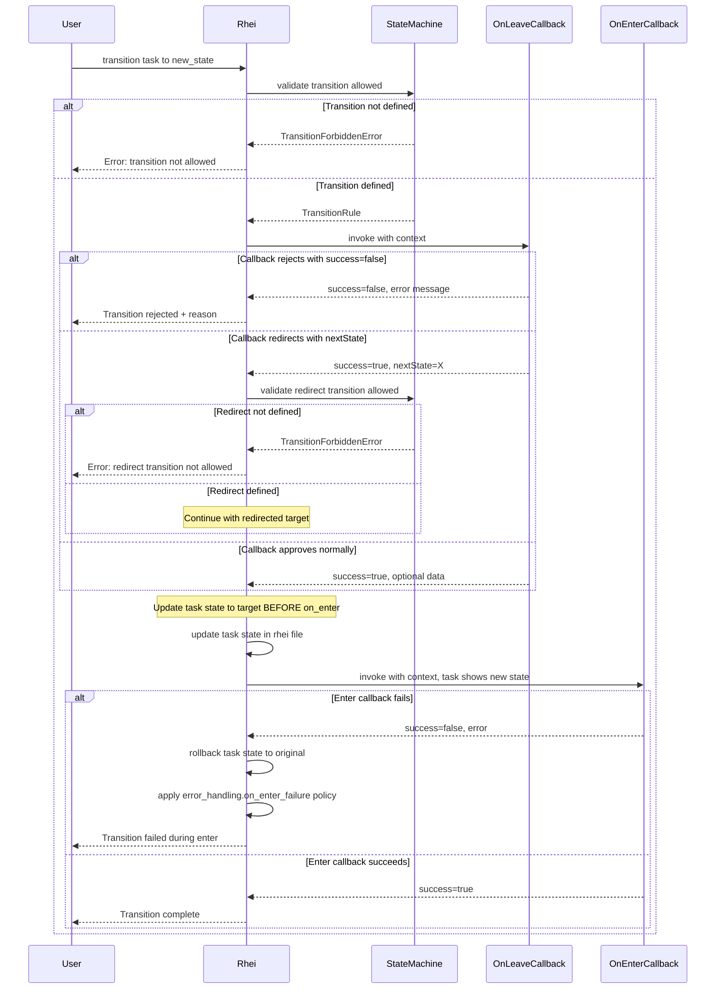

# Rhei Transitions Specification

Formal specification for state transitions with associated function callbacks.

State transitions will be defined declaratively in YAML and executed through platform-specific mechanisms:
- **CLI**: Bash function calls
- **JavaScript**: Native callbacks via NAPI to javascript functions.
- **Python**: Native callbacks via PyO3 bindings to python functions
- **Java**: Calls to Java functions with JNI

### Goals

1. Define state transition rules in YAML that specify valid `from -> to` state changes
2. Associate each transition with a function identifier that gets invoked:
  1. entering the state has one call
  2. leaving the state has another call that returns what is the next state
3. Provide a consistent API across CLI, JavaScript, Python, and Java

### Requirements
- State transitions must be explicitly declared - unlisted transitions are forbidden
- Transitions trigger callbacks/functions that receive context about the task
- Callbacks can reject transitions by returning an error (for conditional logic)
- Failed transitions should be reportable and recoverable
- Registered callbacks must be verified as callable before execution begins (callback existence validation)
- Callbacks (`on_leave`, `on_enter`) are optional per transition - omitted callbacks are treated as implicit success

---

## TransitionContext Data Structure

The `TransitionContext` is the core data structure passed to all transition callbacks. It provides complete context about the rhei, the transitioning task, and the execution environment.

```typescript
type TaskId = string | number;

/**
 * Metadata associated with a task.
 *
 * Note: `state` and `dependsOn` (prior) are always present as implicit fields
 * and don't need to be declared in the metadata section.
 *
 * Custom metadata (like retryCount, priority, etc.) is stored in the YAML
 * metadata section of the rhei file and is available here.
 */
interface TaskMetadata {
  /** Current state of the task - always present, managed by Rhei */
  state: string;
  /** Task dependencies (prior tasks) - always present */
  dependsOn: Array<string | number>;
  /** Custom metadata fields - any additional key-value pairs from YAML */
  [key: string]: any;
}

/** A task being transitioned within the rhei */
interface TaskNode {
  id: TaskId;
  title: string;
  kind: string;
  metadata: TaskMetadata;
  content: string;
  children: TaskNode[];
}

/** A required file artifact declared by the active state */
interface StateArtifact {
  name: string;
  path: string;
  format?: string;
  description?: string;
  exists: boolean;
}

/** Active state definition after template resolution */
interface StateDefinition {
  name: string;
  description: string;
  instructions?: string;
  personality?: string;
  final?: boolean;
  gating?: boolean;
  visits?: number;
  inputs?: StateArtifact[];
  outputs?: StateArtifact[];
}

/** The rhei containing the transitioning task */
interface Rhei {
  title: string;
  /** Path to the plan file */
  path: string;
  tasks: TaskNode[];
}

/** Details about the state transition being performed */
interface TransitionInfo {
  from: string;
  to: string;
  /**
   * How this transition was initiated:
   * - 'user': Explicitly triggered via API (CLI command, programmatic call)
   * - 'callback': Triggered by a callback's nextState override
   * - 'system': Triggered by condition evaluation or timeout
   * - 'engine': Triggered by the Rhei engine during autonomous workflow execution
   */
  triggeredBy: 'user' | 'callback' | 'system' | 'engine';
  timestamp: string;  // ISO 8601 format (e.g., "2024-01-15T10:30:00Z")
}

/** Execution environment information */
interface Environment {
  /** Runtime platform. Use 'nodejs' for JavaScript/TypeScript environments. */
  platform: 'cli' | 'nodejs' | 'python' | 'java';
  version: string;
  workingDirectory: string;
}

/**
 * The context object passed to all transition callbacks.
 *
 * This provides complete information about:
 * - The rhei being executed
 * - The specific task transitioning between states
 * - Details about the transition itself
 * - Data accumulated during this transition
 * - The execution environment
 */
interface TransitionContext {
  /** The rhei being executed */
  rhei: Rhei;

  /** The specific task transitioning */
  task: TaskNode;

  /** Active state definition for the task, including resolved artifact contracts */
  state: StateDefinition;

  /** Transition details */
  transition: TransitionInfo;

  /** Data accumulated during this transition (from on_leave to on_enter) */
  transitionData: Record<string, any>;

  /** Execution environment */
  environment: Environment;
}

/**
 * The result returned from transition callbacks.
 *
 * Callbacks return one of three distinct outcomes:
 *
 * 1. **Success**: Transition proceeds to the declared target state.
 *    ```typescript
 *    return { success: true };
 *    return { success: true, data: { ... } };
 *    ```
 *
 * 2. **Redirect**: Transition proceeds, but to a different valid target state.
 *    The redirected transition MUST be declared in the state machine.
 *    ```typescript
 *    return { success: true, nextState: 'other-state' };
 *    ```
 *
 * 3. **Rejection**: Transition is blocked; task remains in current state.
 *    ```typescript
 *    return { success: false, error: 'Reason for rejection' };
 *    ```
 *
 * Note: `success: false` with `nextState` is invalid and will be treated as rejection.
 */
interface TransitionResult {
  /** Whether the callback approves the transition proceeding */
  success: boolean;
  /** Error message explaining why the transition was rejected (only when success=false) */
  error?: string;
  /**
   * Redirect to a different target state (only when success=true).
   * The redirect MUST correspond to a declared transition from the current state.
   */
  nextState?: string;
  /** Data to pass to subsequent callbacks in this transition */
  data?: Record<string, any>;
}
```

### Usage Example

```typescript
function findTask(nodes: TaskNode[], id: string | number): TaskNode | undefined {
  for (const node of nodes) {
    if (node.id === id) return node;
    const nested = findTask(node.children, id);
    if (nested) return nested;
  }
  return undefined;
}

rhei.onLeave('pending', 'processing', async (ctx: TransitionContext): Promise<TransitionResult> => {
  // Check dependencies before allowing transition
  for (const depId of ctx.task.metadata.dependsOn) {
    const depTask = findTask(ctx.rhei.tasks, depId);
    if (depTask && depTask.metadata.state !== 'completed') {
      return { success: false, error: `Dependency ${depId} not completed` };
    }
  }
  return { success: true, data: { validatedAt: ctx.transition.timestamp } };
});
```

> **More examples:** See [Transition Callback Examples](rhei-callbacks.spec.md) for comprehensive examples across all supported languages (TypeScript, Python, Java, Bash) covering dependency validation, data passing, state redirection, custom metadata access, and environment-aware logic.

---

## Rhei File Metadata Format

Auxiliary task metadata is stored in a **YAML frontmatter section** at the plan
root: in the plan file for single-file plans, or in `index.rhei.md` for
Directory Workspaces. Core markdown task fields such as `**State:**`,
`**Prior:**`, `**Assignee:**`, and `> **Result:**` remain authored in markdown
rather than frontmatter.

### Naming conventions
- In markdown syntax: Use `**Prior:** Task N` to declare dependencies
- In TypeScript/JavaScript: Access via `task.metadata.dependsOn` (camelCase)
- In Python: Access via `task.metadata.depends_on` (snake_case, idiomatic Python)
- In Java: Access via `task.getMetadata().getDependsOn()` (camelCase getters)
- In CLI JSON: Access via `task.metadata.dependsOn` (camelCase, raw JSON)

Each platform's SDK exposes the shared data model using its idiomatic naming convention. The bindings handle translation between platform-idiomatic names and the canonical camelCase JSON form.

### Metadata Storage Example

```markdown
# Rhei: Feature Branch CI Pipeline

---
metadata:
  tasks:
    1:
      retryCount: 2
      stateVisits:
        agent-review: 1
      lastAttempt: "2024-01-15T10:30:00Z"
    3:
      priority: "high"
      estimatedDuration: "30m"
---

## Tasks

### Task 1: Code Analysis
**State:** pending

...
```

The YAML frontmatter between `---` markers contains:
- `metadata.tasks.<id>` - Custom metadata for each task, keyed by task ID
- Any key-value pairs needed by callbacks or conditions (e.g., `retryCount`, `priority`)
- `metadata.tasks.<id>.stateVisits.<state-name>` - Runtime-maintained counted-loop counters for states that declare a `visits` limit

Markdown-owned task fields are not duplicated in frontmatter. In particular,
`**Assignee:**` remains a markdown field even when runtimes expose it through
callback APIs.

### Counted Loop Metadata

When a state declares `visits: <n>`, the engine tracks the current per-task loop count in:

- `metadata.tasks.<id>.stateVisits.<state-name>`

These counters are maintained by the runtime rather than authored manually in normal workflows. Entering a counted state records the first visit as `1`, including when a task starts in that state. Each later re-entry increments the counter again.

The active visit is also visible in markdown:

- first visit: `**State:** review`
- second visit: `**State:** review-2`
- third visit: `**State:** review-3`

The `-1` suffix is never written; first visit is implicit. The suffixed form is
valid only when the base state declares `visits`, and the suffix must not
exceed that state's declared visit budget.

### Metadata Access in Callbacks

When a transition callback is invoked, the metadata is merged into `task.metadata`:

```typescript
rhei.onLeave('retrying', 'processing', (ctx: TransitionContext) => {
  // Access custom metadata fields
  const retryCount = ctx.task.metadata.retryCount ?? 0;
  const maxRetries = 3;  // Could also be from state machine config

  if (retryCount >= maxRetries) {
    return { success: true, nextState: 'manual-intervention' };
  }

  return { success: true };
});
```

Runtimes may additionally project markdown-owned fields into the callback view
for convenience. For example, `task.metadata.assignee` may mirror the current
`**Assignee:**` line when one exists. This is a computed projection for callback
consumers, not a second persisted `metadata.tasks.<id>.assignee` source of
truth.

For counted loops, runtimes should additionally expose:

- `ctx.task.metadata.stateVisits` for the persisted per-state counters
- `ctx.task.metadata.visitCount` as the active state's current loop count
- `ctx.state.visits` as the active state's configured loop budget

---

## Transition Triggers

Transitions can be produced by seven distinct mechanisms. The `triggeredBy` field has four values (`user`, `callback`, `system`, `engine`) that classify these mechanisms — the three system-driven mechanisms (program exit-code, agent timeout, tooling-unavailable) all report `triggeredBy: 'system'`:

### 1. User Trigger (`triggeredBy: 'user'`)

Explicitly initiated by a human or external system call via the Rhei API:

**CLI:**
```bash
# Transition a specific task to a new state (compare-and-swap via --from)
rhei transition my-rhei.rhei.md --task 1 --from pending --to running

# Or during interactive execution
rhei run my-rhei.rhei.md --interactive
```

**JavaScript:**
```typescript
const rhei = new Rhei({ rheiPath: './my-rhei.rhei.md' });
await rhei.transition(taskId, 'running');  // triggeredBy: 'user'
```

**Python:**
```python
rhei = Rhei(rhei_path="./my-rhei.rhei.md")
rhei.transition(task_id, "running")  # triggeredBy: 'user'
```

### 2. Callback Trigger (`triggeredBy: 'callback'`)

Occurs when a callback returns a `nextState` override, causing an automatic follow-up transition:

```typescript
rhei.onLeave('processing', 'review', (ctx) => {
  if (ctx.task.metadata.autoApprove) {
    // Skip review, go directly to done
    return { success: true, nextState: 'done' };  // triggeredBy: 'callback'
  }
  return { success: true };  // Normal flow to 'review'
});
```

### 3. System Trigger (`triggeredBy: 'system'`)

Automatic transitions based on conditions, timers, or events configured in the state machine:

```yaml
transitions:
  - from: retrying
    to: manual-intervention
    condition: retryCount >= 3  # System evaluates this automatically

  - from: pending
    to: expired
    timeout: 24h  # System triggers after timeout
```

### 4. Engine Trigger (`triggeredBy: 'engine'`)

When using `rhei.run()` or similar autonomous execution modes, the Rhei engine advances the workflow by triggering transitions on tasks whose dependencies are satisfied:

```typescript
// Engine-driven execution
const rhei = new Rhei({ rheiPath: './my-rhei.rhei.md' });
await rhei.run();  // Engine triggers transitions as tasks become ready
```

This is distinct from `system` triggers (which are condition/timer-based) and `user` triggers (which are explicit API calls). Engine triggers represent the normal workflow progression during autonomous execution.

### 5. Program Exit-Code Trigger (`triggeredBy: 'system'`)

When a program state's subprocess exits and has not already advanced the task (via `rhei transition` or `rhei complete`), the engine evaluates exit-code transitions:

1. Collect all transitions from the current state that declare an `exit_code` field.
2. Match the actual exit code against specific integers and arrays first.
3. If no specific match and exit code is non-zero, try `"nonzero"` transitions.
4. If multiple transitions match, evaluate `condition` fields to disambiguate.
5. The matching transition fires with `triggeredBy: 'system'`.
6. The transition's `on_leave` and `on_enter` callbacks execute normally.

```yaml
states:
  build:
    program: "make build"
    program_timeout: 10m

  test:
    description: Run tests
    program: "make test"

transitions:
  - from: build
    to: test
    description: Build succeeded
    exit_code: 0

  - from: build
    to: failed
    description: Build failed
    exit_code: nonzero
    on_enter: "cli:bash ./workflow.sh notify-build-failure"
```

The `exit_code` field on the transition is only meaningful for program states. Declaring `exit_code` on a transition from a non-program state is a validation error. See [Program States Specification](rhei-programs.spec.md) for the complete exit-code evaluation algorithm and validation rules.

### 6. Agent Timeout Trigger (`triggeredBy: 'system'`)

When `rhei run` spawns an agent for a state that declares `agent_timeout`, the engine monitors the agent process duration. If the agent exceeds the timeout:

1. The engine sends `SIGTERM` to the agent, then `SIGKILL` after a 10-second grace period.
2. The engine evaluates transitions from the current state that have a `timeout` field.
3. If a matching timeout transition exists, it fires with `triggeredBy: 'system'`.
4. The transition's `on_leave` and `on_enter` callbacks execute normally.
5. If no timeout transition exists, the task remains in its current state and a warning is logged.

```yaml
states:
  pending:
    agent: claude-code
    agent_timeout: 30m

  timed-out:
    gating: true
    description: Agent exceeded time budget. Human must decide next step.

transitions:
  - from: pending
    to: timed-out
    description: Agent exceeded the time budget
    timeout: 30m
    on_enter: "cli:bash ./workflow.sh notify-timeout"

  - from: timed-out
    to: pending
    description: Human decided to retry after timeout

  - from: timed-out
    to: cancelled
    description: Human decided to abandon after timeout
```

The `timeout` field on the transition serves dual purpose: it marks the transition as a timeout handler for `rhei run` agent mode, and it can be used by other runtimes for time-based system triggers. The `transitionData` for timeout-triggered transitions includes `{ "timeout": "<duration>", "agent": "<agent-id>" }`.

See [Agents Specification — Timeout Handling](rhei-agents.spec.md#timeout-handling) for the full timeout configuration and behavior.

### 7. Tooling-Unavailable Trigger (`triggeredBy: 'system'`)

When `rhei run` is about to spawn an agent for a state that declares required
MCP servers or skills (`optional: false`, the default), the engine first
checks availability. If any required entry fails its availability check:

1. The engine does not spawn the agent.
2. It collects the ids of the failed required entries.
3. It evaluates transitions from the current state whose `mcp_unavailable`
   or `skill_unavailable` field matches. `true` matches any failure of that
   kind; an explicit id list matches only when one of the listed ids failed.
4. If a matching transition exists, it fires with `triggeredBy: 'system'`.
5. The transition's `on_leave` and `on_enter` callbacks execute normally.
6. If no matching transition exists, the task remains in its current state
   and `rhei run` logs an error listing the unavailable ids.

```yaml
states:
  agent-review:
    description: Independent review with required tooling.
    agent: codex
    mcp_servers:
      - id: postgres
      - id: grafana
        optional: true

  tooling-missing:
    gating: true
    description: Required tooling is unavailable. Human must decide next step.

transitions:
  - from: agent-review
    to: tooling-missing
    description: A required MCP server was unavailable
    mcp_unavailable: true
    on_enter: "cli:bash ./workflow.sh notify-tooling-missing"

  - from: tooling-missing
    to: agent-review
    description: Human confirmed tooling is back, retry review

  - from: tooling-missing
    to: cancelled
    description: Human abandoned after persistent tooling failure
```

A transition may also target specific ids:

```yaml
transitions:
  - from: deploy
    to: blocked-on-cloud
    description: Cloud MCP specifically is unavailable
    mcp_unavailable: [cloud-provider]
```

The `transitionData` for tooling-triggered transitions includes
`{ "unavailable": ["<id>", ...], "kind": "mcp" | "skill" }`. Optional
(`optional: true`) entries never trigger these transitions — they are dropped
with a warning regardless.

See [Agents Specification — Missing Tooling](rhei-agents.spec.md#missing-tooling)
for availability semantics and
[States Specification — MCP Servers and Skills](rhei-states.spec.md#mcp-servers-and-skills)
for the per-state `mcp_servers` and `skills` fields.

---

## YAML State Machine Format Specification

This section defines the formal structure of YAML state machine configuration files. All state machines must conform to this specification.

### Root-Level Fields

| Field | Type | Required | Description |
|-------|------|----------|-------------|
| `name` | string | Yes | Unique identifier for the state machine |
| `models` | string array | No | Declared model profile identifiers available to states in this machine |
| `version` | string | Yes | Semantic version of the state machine definition |
| `states` | object | Yes | Map of state names to state definitions |
| `transitions` | array | Yes | List of allowed state transitions |
| `callbacks` | object | No | Platform-specific callback mappings |
| `error_handling` | object | No | Error handling and recovery configuration |

### State Definition

Each state is defined as a key-value pair in the `states` object:

```yaml
states:
  <state-name>:
    description: <string>       # Required: Human-readable description of the state
    instructions: <string>      # Optional: Agent-facing instructions for work in this state
    final: <boolean>            # Optional: true if this is a terminal state (no outgoing transitions)
    gating: <boolean>           # Optional: true if no autonomous (agent/engine) transitions are allowed out
    visits: <integer>           # Optional: maximum number of visits permitted for this state
    target: <string>            # Optional: inline execution target selector
    all_targets: [<string>]     # Optional: run this state once per listed target
    all_models: [<string>]      # Optional: list of declared model profiles; run this state once per listed model
    model: <string>             # Optional: one declared model profile allowed for this state
    agent: <string>             # Optional: coding agent id for this state (see Agents Specification)
    agent_mode: <string>        # Optional: named mode on the resolved agent
    agent_timeout: <duration>   # Optional: max time an agent may work in this state (e.g., "30m")
    program: <string|object>    # Optional: deterministic program to execute (see Program States Specification)
    program_timeout: <duration> # Optional: max time a program may run in this state (e.g., "10m")
    mcp_servers: [<string|object>]  # Optional: MCP servers attached to the agent for this state
    skills: [<string|object>]       # Optional: agent skills enabled for this state
```

| Field | Type | Required | Description |
|-------|------|----------|-------------|
| `description` | string | Yes | Human-readable explanation of what this state represents |
| `instructions` | string | No | Agent-facing guidance for work in this state. Supports [template variables](rhei-states.spec.md#template-variables-in-instructions-and-personality) resolved by `rhei next` at output time. |
| `personality` | string | No | Optional role framing printed alongside the next claimed task when this state is active. Supports [template variables](rhei-states.spec.md#template-variables-in-instructions-and-personality). |
| `final` | boolean | No | Marks this as a terminal state. Tasks in final states cannot transition further |
| `gating` | boolean | No | Marks this as a gating state. When `true`, autonomous commands (`rhei next`, `rhei complete`, engine-triggered transitions) must not transition out of this state. Only explicit human-initiated transitions (`rhei transition` with `triggeredBy: 'user'`) are allowed. |
| `visits` | integer | No | Maximum number of visits permitted for this state before the loop budget is exhausted |
| `target` | string | No | Inline execution target selector. Preferred over the legacy `model` + `agent` split for new workflows. |
| `all_targets` | string array | No | Explicit list of execution target selectors; the state runs once for each listed target. Preferred over `all_models` for new fanout workflows. |
| `all_models` | string array | No | Explicit list of declared model profile identifiers; the state runs once for each listed model |
| `model` | string | No | Restricts the state to one model profile declared in the machine-level `models` list |
| `agent` | string | No | Coding agent id for this state. Must resolve against the merged `agents` registry (built-ins + `settings.json`). Inline agent objects are not accepted — declare custom agents in `agents.<id>` first. See [Agents Specification](rhei-agents.spec.md). |
| `agent_mode` | string | No | Named flag set from the resolved agent's `modes` map (e.g., `yolo`, `safe`). See [Agents Specification — Modes](rhei-agents.spec.md#modes). |
| `agent_timeout` | string | No | Maximum time an agent may work in this state (e.g., `30m`, `1h`). When exceeded, `rhei run` kills the agent and fires a timeout transition if one is declared. |
| `program` | string or object | No | Deterministic program command for this state. String form runs via shell. Object form specifies `command`, `env`, `working_directory`. Mutually exclusive with `agent`. See [Program States Specification](rhei-programs.spec.md). |
| `program_timeout` | string | No | Maximum time a program may run in this state (e.g., `10m`, `1h`). Same timeout mechanism as `agent_timeout`. |
| `inputs` | artifact array | No | Required file artifacts that must exist before entering or working this state |
| `outputs` | artifact array | No | Required file artifacts that must exist before leaving this state |
| `mcp_servers` | array | No | MCP server entries (ids or inline definitions) attached to the agent subprocess. Individual entries may be marked `optional: true`. Mutually exclusive with `gating: true` and `program:`. See [States Specification — MCP Servers and Skills](rhei-states.spec.md#mcp-servers-and-skills). |
| `skills` | array | No | Skill entries enabled for the agent in this state. Same shape and exclusions as `mcp_servers`. |

Model selection rules:
- The machine-level `models` list is optional. When omitted, states are not model-constrained.
- A state may set `target: <selector>` or `all_targets: [<selector>, ...]` as
  an inline execution selector.
- `target` and `all_targets` are mutually exclusive.
- `target` / `all_targets` must not be combined with `model`, `all_models`,
  `agent`, or `agent_mode`.
- Target selectors must use one of these forms:
  `<agent>:<model>`, `<agent>[<mode>]:<model>`,
  `<agent>:<provider>:<model>`, or
  `<agent>[<mode>]:<provider>:<model>`.
- `all_targets`, when present, must be a non-empty list of unique selectors.
- In a target selector, `<agent>` must resolve against the merged `agents`
  registry.
- In a target selector, `<mode>`, when present, must resolve against the
  selected agent's declared modes.
- In a target selector, `<provider>`, when present, must be non-empty.
- In a target selector, `<model>` must be non-empty.
- A state may set `all_models: [<name>, ...]` or `model: <name>`, but not both.
- `model` must reference a value declared in the machine-level `models` list.
- `all_models`, when present, must be a non-empty list of unique values declared in the machine-level `models` list.
- A state with `all_models` is executed once per listed model.
- A state with `all_targets` is executed once per listed target.
- `visits` may be combined with either `all_models` or `model`.
- `visits` may also be combined with either `all_targets` or `target`.
- `visits`, when present, must be an integer greater than or equal to `1`.
- `inputs` and `outputs`, when present, must be arrays of unique artifact definitions keyed by `name`.
- Artifact `path` values are execution-root-relative templates; see [main spec — State Artifact Contracts](../rhei.spec.md#10-state-artifact-contracts) for the definition of execution root. After expansion, they must remain within that root.

Artifact definition:

```yaml
states:
  review:
    outputs:
      - name: findings
        path: runtime/findings/{task_id}.md
        description: Concrete review findings for the task
```

| Field | Type | Required | Description |
|-------|------|----------|-------------|
| `name` | string | Yes | Stable identifier for the artifact within that state |
| `path` | string | Yes | Workspace-relative file path template |
| `description` | string | No | Human-readable explanation of the artifact |

Supported template variables:

- `{task_id}` - current task id
- `{state}` - canonical unsuffixed state name
- `{visit_count}` - current visit number for counted-loop states (only available when the state declares `visits`)
- `{target}` - current execution target selector (only available when the state declares `target` or `all_targets`)
- `{target.slug}` - filesystem-safe slug for the current target selector
- `{agent}` - current agent id
- `{agent.mode}` - current agent mode, if any
- `{model}` - current model identifier (available when the state declares `target`, `all_targets`, `model`, or `all_models`)
- `{model.provider}` - current model provider id
- `{model.name}` - current provider model name

### Counted Loops

This section describes the runtime semantics of the `visits` field, also
called *counted visits* in the main plan specification and the states
specification. The three terms — `visits`, *counted visits*, and *counted
loops* — refer to the same mechanism.

`visits` is a state-level loop budget. It is used when a workflow intentionally cycles through the same state multiple times before taking a non-loop exit.

Rules:

- `visits` applies to every entry into that state, including the initial entry and later loop-back re-entries.
- Starting in a counted state records `metadata.tasks.<id>.stateVisits.<state-name> = 1`.
- Each later loop-back re-entry increments `metadata.tasks.<id>.stateVisits.<state-name>` by `1`.
- The task's active `**State:**` value mirrors that count by writing `<state>-<n>` for visits greater than `1`; visit `1` stays as the bare state name.
- When evaluating transitions from a counted-loop state, runtimes should expose:
  - `visitCount`: the current value of `metadata.tasks.<id>.stateVisits.<state-name>`
  - `visits`: the configured state-level loop budget
- Once `visitCount >= visits`, further loop-back transitions into that state are exhausted and the machine must take another allowed transition such as escalation, human review, or completion.
- When a state also declares `all_models`, visit accounting is scoped to each model-specific execution of that state.
- When a state also declares `all_targets`, visit accounting is scoped to each target-specific execution of that state.

Example:

```yaml
states:
  agent-review:
    description: Review the implementation
    instructions: |
      Review the implementation. If changes are needed and loop budget remains,
      transition to `agent-review-fix`. If the loop budget is exhausted,
      transition to `human-review`.
    visits: 3

  agent-review-fix:
    description: Apply reviewer findings
    instructions: |
      Address reviewer findings only, then transition back to `agent-review`.

  human-review:
    description: Human escalation after repeated review/fix cycles

transitions:
  - from: pending
    to: agent-review
    description: Submit implementation for review

  - from: agent-review
    to: agent-review-fix
    description: Review requested changes while loop budget remains
    condition: visitCount < visits

  - from: agent-review
    to: human-review
    description: Escalate after the counted review/fix loop is exhausted
    condition: visitCount >= visits

  - from: agent-review-fix
    to: agent-review
    description: Re-submit after fixes; increments the `agent-review` visit counter to the next visit
```

### Transition Definition

Each transition in the `transitions` array specifies an allowed state change:

```yaml
transitions:
  - from: <state-name|"*">  # Required: Source state or wildcard
    to: <state-name>        # Required: Target state
    description: <string>   # Required: Explanation of when/why this transition occurs
    on_leave: <callback>    # Optional: Callback invoked when leaving the source state
    on_enter: <callback>    # Optional: Callback invoked when entering the target state
    condition: <expression> # Optional: Condition that must be true for system-triggered transitions
    timeout: <duration>     # Optional: Duration after which system triggers this transition
    exit_code: <int|array|"nonzero">  # Optional: Exit-code condition for program state transitions
    mcp_unavailable: <bool|[<id>, ...]>    # Optional: Fires when a required MCP server is unavailable
    skill_unavailable: <bool|[<id>, ...]>  # Optional: Fires when a required skill is unavailable
    max_retries: <integer>  # Optional: Maximum retry attempts for this transition
    retry_delay: <duration> # Optional: Delay between retry attempts
```

| Field | Type | Required | Description |
|-------|------|----------|-------------|
| `from` | string | Yes | Source state name, or `"*"` for wildcard (matches any non-final state) |
| `to` | string | Yes | Target state name |
| `description` | string | Yes | Human-readable explanation of the transition's purpose and when it occurs |
| `on_leave` | string | No | Callback function identifier invoked before leaving the source state |
| `on_enter` | string | No | Callback function identifier invoked after entering the target state |
| `condition` | string | No | Expression evaluated for system-triggered transitions |
| `timeout` | string | No | Duration (e.g., `24h`, `30m`) after which system triggers this transition |
| `exit_code` | integer, integer array, or `"nonzero"` | No | Exit-code condition for transitions from program states. Only evaluated when a program exits without calling `rhei transition`. See [Program States Specification](rhei-programs.spec.md#exit-code-transitions). |
| `mcp_unavailable` | boolean or string array | No | When `true`, fires when any required MCP server on the source state fails its availability check. When an array, fires only when one of the listed ids failed. Only valid on transitions from agent states. See [Tooling-Unavailable Trigger](#7-tooling-unavailable-trigger-triggeredby-system). |
| `skill_unavailable` | boolean or string array | No | Same shape as `mcp_unavailable`, for skills. |
| `max_retries` | integer | No | Maximum automatic retry attempts |
| `retry_delay` | string | No | Delay between retries (e.g., `30s`, `5m`) |

### Artifact Enforcement

State artifact contracts (see [States Specification — Artifact Contracts](rhei-states.spec.md#artifact-contracts) for the schema) are enforced around transitions:

1. Before entering a target state, the runtime resolves `target.inputs` and
   rejects the transition if any required input file does not exist.
2. After `on_leave` / `on_enter` callbacks complete, but before the state write
   is committed, the runtime resolves `source.outputs` and rejects the
   transition if any required output file does not exist.
3. `rhei complete` is subject to the same output checks as `rhei transition`.
4. In v1, enforcement is file-existence only. Content validation is out of
   scope.

This makes artifact production and consumption part of the state-machine
contract instead of a convention in free-form instructions.

### Wildcard Semantics

The special value `"*"` in the `from` field matches any state with these rules:
- Matches any state **except** final states (states with `final: true`)
- Specific transitions take precedence over wildcard transitions
- A transition from a final state is always forbidden, even with wildcards

Wildcards are optional. When a machine omits wildcards, only explicitly declared transitions are valid. Engines must not synthesize wildcard transitions; if cancellation from a particular state is desired, it must be declared explicitly (as the default `rhei` machine does).

### Callback Declaration

There are two valid ways to declare callbacks on transitions:

**1. Platform-prefixed inline identifiers.** The `on_leave`/`on_enter` value includes a platform prefix (`cli:`, `js:`, `py:`, `java:`) followed by the implementation reference. No separate `callbacks:` mapping is needed. Use this when the machine targets a single platform or when each transition has a single implementation.

```yaml
transitions:
  - from: pending
    to: running
    on_leave: cli:validate_preconditions    # Bash function
    on_enter: js:startWork                  # JavaScript function
```

**2. Logical names with a `callbacks:` mapping.** The `on_leave`/`on_enter` values use platform-agnostic logical names. A top-level `callbacks:` section maps each logical name to platform-specific implementations. Use this when the same machine must work across multiple platforms.

```yaml
transitions:
  - from: pending
    to: active
    on_leave: prepare_activation   # Logical name, resolved via callbacks:

callbacks:
  cli:
    prepare_activation: ./handlers.sh:prepare_activation
  nodejs:
    prepare_activation: ./handlers.js:prepareActivation
  python:
    prepare_activation: handlers:prepare_activation
```

Both models are valid. They must not be mixed within a single transition (a callback value is either prefixed or logical, not both). When both a prefix and a `callbacks:` mapping exist for the same name, the prefix takes precedence.

### Callback Mappings

Platform-specific callback mappings allow the same logical callback name to resolve to different implementations:

```yaml
callbacks:
  <platform>:
    <callback-name>: <implementation-path>
```

Platform identifiers must match `Environment.platform` values:
- `cli`: Command-line execution with bash functions
- `nodejs`: JavaScript/TypeScript via NAPI
- `python`: Python via PyO3 bindings
- `java`: Java via JNI

### Error Handling Configuration

```yaml
error_handling:
  on_enter_failure:
    - <action>              # Actions to take when on_enter callback fails
  on_leave_rejection:
    - <action>              # Actions to take when on_leave callback rejects
```

---

## Examples

> The examples in this section focus on state definitions, transitions, and
> callback wiring. For readability they omit the top-level `profiles` and
> `node_policy` blocks that a complete state machine YAML must declare. See
> the [States Specification](rhei-states.spec.md#profiles) for the full
> profile and node-policy model and the
> [reference machine](states.yaml) for a complete example.

### Example 1: YAML State Machine Definition with Transitions

This extends the existing [`states.yaml`](states.yaml) format to include formal transitions and callbacks:

```yaml
# states-with-transitions.yaml
name: ci-pipeline-states
version: 2.0

states:
  draft:
    description: Task is being planned

  pending:
    description: Task ready to start

  in-progress:
    description: Task currently being worked on

  human-review:
    description: Awaiting human approval
    gating: true

  agent-review:
    description: Automated validation in progress

  completed:
    description: Task finished successfully
    final: true

  cancelled:
    description: Task abandoned
    final: true

# Explicit transition rules - any transition not listed here is FORBIDDEN.
# This includes callback redirects: a nextState override must correspond to
# a declared transition from the current state.
transitions:
  - from: draft
    to: pending
    description: Task planning is complete and ready for execution
    on_leave: validate_task_ready      # Called when leaving 'draft'
    on_enter: notify_task_pending      # Called when entering 'pending'

  - from: pending
    to: in-progress
    description: Work begins on the task
    on_leave: acquire_resources
    on_enter: start_work_timer

  - from: in-progress
    to: human-review
    description: Task requires human approval before completion
    on_leave: package_for_review
    on_enter: notify_reviewers

  - from: in-progress
    to: agent-review
    description: Task requires automated validation before completion
    on_leave: prepare_validation_context
    on_enter: run_automated_checks

  - from: human-review
    to: in-progress
    description: Reviewer requested changes, task returns to active work
    on_leave: collect_feedback
    on_enter: apply_review_changes

  - from: human-review
    to: completed
    description: Human reviewer approved the task
    on_leave: finalize_approval
    on_enter: record_completion

  - from: agent-review
    to: in-progress
    description: Automated checks found issues requiring fixes
    on_leave: report_validation_issues
    on_enter: apply_fixes

  - from: agent-review
    to: completed
    description: Automated validation passed successfully
    on_leave: archive_validation_results
    on_enter: record_completion

  # Any state can be cancelled (wildcard transition)
  - from: "*"
    to: cancelled
    description: Task is abandoned and will not be completed
    on_leave: cleanup_resources
    on_enter: log_cancellation

# Wildcard Semantics:
# - "*" matches any state EXCEPT final states (states with `final: true`)
# - Specific transitions take precedence over wildcard transitions
# - A transition from a final state is always forbidden, even with wildcards
```

---

### Example 2: CLI Integration with Bash Functions

When using the CLI, callbacks map to bash functions that receive task context as JSON on stdin:

**states-cli.yaml:**
```yaml
name: cli-workflow
version: 1.0

states:
  pending:
    description: Task is waiting to be executed
  running:
    description: Script execution in progress
  completed:
    description: Task finished successfully
    final: true
  failed:
    description: Task execution failed
    final: true

transitions:
  - from: pending
    to: running
    on_leave: cli:validate_preconditions
    on_enter: cli:start_execution

  - from: running
    to: completed
    on_leave: cli:capture_outputs
    on_enter: cli:report_success

  - from: running
    to: failed
    on_leave: cli:capture_error_context
    on_enter: cli:report_failure
```

**workflow-handlers.sh:**
```bash
#!/usr/bin/env bash
# Handlers sourced by rhei-cli when executing transitions
#
# CLI Callback Contract:
# - Receive TransitionContext as JSON on stdin
# - Return TransitionResult as JSON on stdout (same format as other platforms)
# - Exit code 0 = callback executed successfully (check 'success' field for result)
# - Exit code non-zero = callback crashed (treated as rejection)

# Called when leaving 'pending' state
validate_preconditions() {
    local context
    context=$(cat)  # Read JSON from stdin

    task_id=$(echo "$context" | jq -r '.task.id')
    dependencies=$(echo "$context" | jq -r '.task.metadata.dependsOn[]')

    # Check all dependencies are completed
    for dep in $dependencies; do
        dep_state=$(echo "$context" | jq -r ".rhei.tasks[] | select(.id == \"$dep\") | .metadata.state")
        if [[ "$dep_state" != "completed" ]]; then
            # Return proper TransitionResult with success=false
            echo '{"success": false, "error": "Dependency not met: '$dep'"}'
            return 0  # Exit 0 because callback ran successfully; success=false rejects
        fi
    done

    echo '{"success": true, "data": {"message": "All preconditions met"}}'
    return 0
}

# Called when entering 'running' state
start_execution() {
    local context
    context=$(cat)

    task_id=$(echo "$context" | jq -r '.task.id')
    echo '{"success": true, "data": {"task_id": "'$task_id'", "timestamp": "'$(date -Iseconds)'"}}'
}

# Called when leaving 'running' to determine next state
capture_outputs() {
    local context
    context=$(cat)

    # Return next state based on exit code of the task
    exit_code=$(echo "$context" | jq -r '.execution.exit_code // 0')

    if [[ "$exit_code" -eq 0 ]]; then
        echo '{"success": true, "data": {"outputs": {}}}'
    else
        # Redirect to 'failed' state
        echo '{"success": true, "nextState": "failed", "data": {"errorCode": '$exit_code'}}'
    fi
}
```

**CLI invocation:**
```bash
# Execute a rhei with custom handlers
rhei-cli run examples/release-automation.rhei.md \
    --state-machine states-cli.yaml \
    --handlers ./workflow-handlers.sh
```

---

### Example 3: JavaScript Integration via NAPI

JavaScript callbacks are registered as native functions and called synchronously during transitions:

**states-js.yaml:**
```yaml
name: nodejs-workflow
version: 1.0

states:
  idle:
  processing:
    description: Async operation in progress
  awaiting-confirmation:
    description: User confirmation required
  done:
    final: true

transitions:
  - from: idle
    to: processing
    on_leave: js:prepareProcessing
    on_enter: js:startAsyncWork

  - from: processing
    to: awaiting-confirmation
    on_leave: js:packageResults
    on_enter: js:promptUser

  - from: processing
    to: done
    on_leave: js:skipConfirmation
    on_enter: js:finalizeWorkflow

  - from: awaiting-confirmation
    to: done
    on_leave: js:validateConfirmation
    on_enter: js:finalizeWorkflow
```

**workflow.ts:**
```typescript
import { Rhei, TransitionContext, TransitionResult } from 'rhei-napi';

// Initialize Rhei with state machine
const rhei = new Rhei({
  stateMachine: './states-js.yaml',
  rheiPath: './my-workflow.rhei.md'
});

function findTask(nodes, id) {
  for (const node of nodes) {
    if (node.id === id) return node;
    const nested = findTask(node.children, id);
    if (nested) return nested;
  }
  return undefined;
}

// Register transition handlers
rhei.onLeave('idle', 'processing', async (ctx: TransitionContext): Promise<TransitionResult> => {
  console.log(`Preparing task ${ctx.task.id} for processing...`);

  // Validate preconditions
  const allDepsComplete = ctx.task.metadata.dependsOn.every(depId => {
    const dep = findTask(ctx.rhei.tasks, depId);
    return dep?.metadata.state === 'done';
  });

  if (!allDepsComplete) {
    return {
      success: false,
      error: 'Dependencies not satisfied'
    };
  }

  return { success: true };
});

rhei.onEnter('processing', async (ctx: TransitionContext): Promise<TransitionResult> => {
  console.log(`Starting async work for task ${ctx.task.id}`);

  // Start background processing
  await startBackgroundJob(ctx.task);

  return {
    success: true,
    data: { jobId: generateJobId() }
  };
});

rhei.onLeave('processing', 'awaiting-confirmation', async (ctx: TransitionContext): Promise<TransitionResult> => {
  // Determine next state based on processing results
  const results = await getProcessingResults(ctx.task.id);

  if (results.requiresConfirmation) {
    return {
      success: true,
      nextState: 'awaiting-confirmation',
      data: { results }
    };
  }

  // Skip confirmation, go directly to done
  return {
    success: true,
    nextState: 'done',
    data: { results }
  };
});

// Execute the workflow
await rhei.run();
```

---

### Example 4: Python Integration via PyO3

Python callbacks use decorators to register handlers:

**states-python.yaml:**
```yaml
name: ml-pipeline
version: 1.0

states:
  queued:
    description: Job is registered and waiting for processing
  preprocessing:
    description: Data preparation phase
  training:
    description: Model training in progress
  evaluating:
    description: Model evaluation phase
  deployed:
    description: Model deployed to production
    final: true
  failed:
    description: Pipeline execution failed
    final: true

transitions:
  - from: queued
    to: preprocessing
    on_leave: py:validate_dataset
    on_enter: py:start_preprocessing

  - from: preprocessing
    to: training
    on_leave: py:finalize_features
    on_enter: py:initialize_training

  - from: training
    to: evaluating
    on_leave: py:save_checkpoint
    on_enter: py:run_evaluation

  - from: evaluating
    to: deployed
    on_leave: py:validate_metrics
    on_enter: py:deploy_model

  - from: "*"
    to: failed
    on_leave: py:capture_failure
    on_enter: py:notify_failure
```

**ml_workflow.py:**
```python
from rhei import Rhei, on_leave, on_enter, TransitionContext, TransitionResult
from typing import Optional

rhei = Rhei(
    state_machine="./states-python.yaml",
    rhei_path="./ml-pipeline.rhei.md"
)

@rhei.on_leave("queued", "preprocessing")
def validate_dataset(ctx: TransitionContext) -> TransitionResult:
    """Validate dataset exists and is properly formatted."""
    task = ctx.task

    dataset_path = task.metadata.get("dataset_path")
    if not dataset_path or not Path(dataset_path).exists():
        return TransitionResult(
            success=False,
            error=f"Dataset not found: {dataset_path}"
        )

    # Validate schema
    if not validate_schema(dataset_path):
        return TransitionResult(
            success=False,
            error="Dataset schema validation failed"
        )

    return TransitionResult(success=True)


@rhei.on_enter("training")
def initialize_training(ctx: TransitionContext) -> TransitionResult:
    """Set up training environment and begin model training."""
    task = ctx.task

    # Initialize training configuration
    config = {
        "epochs": task.metadata.get("epochs", 100),
        "batch_size": task.metadata.get("batch_size", 32),
        "learning_rate": task.metadata.get("lr", 0.001),
    }

    # Start training job
    job_id = training_service.start(config)

    return TransitionResult(
        success=True,
        data={"job_id": job_id, "config": config}
    )


@rhei.on_leave("training", "evaluating")
def save_checkpoint(ctx: TransitionContext) -> TransitionResult:
    """Save model checkpoint and determine if evaluation should proceed."""
    task = ctx.task
    job_id = ctx.transition_data.get("job_id")

    # Get training metrics
    metrics = training_service.get_metrics(job_id)

    if metrics["loss"] > 10.0:  # Training diverged
        return TransitionResult(
            success=True,
            next_state="failed",  # Override: go to failed instead of evaluating
            error="Training diverged - loss too high"
        )

    # Save checkpoint
    checkpoint_path = save_model_checkpoint(job_id)

    return TransitionResult(
        success=True,
        data={"checkpoint": checkpoint_path, "metrics": metrics}
    )


@rhei.on_leave("evaluating", "deployed")
def validate_metrics(ctx: TransitionContext) -> TransitionResult:
    """Validate model meets deployment criteria."""
    metrics = ctx.transition_data.get("metrics", {})

    min_accuracy = 0.85
    if metrics.get("accuracy", 0) < min_accuracy:
        return TransitionResult(
            success=False,
            error=f"Accuracy {metrics.get('accuracy')} below threshold {min_accuracy}"
        )

    return TransitionResult(success=True)


if __name__ == "__main__":
    rhei.run()
```

---

### Example 5: Java Integration via JNI

Java callbacks are resolved from fully qualified static method names declared by the state machine:

**states-java.yaml:**
```yaml
name: enterprise-workflow
version: 1.0

states:
  submitted:
    description: Workflow request received and awaiting validation
  validating:
    description: Business rule validation
  approved:
    description: Awaiting execution
  executing:
    description: Workflow execution in progress
  completed:
    description: Workflow finished successfully
    final: true
  rejected:
    description: Workflow request rejected by validation
    final: true

transitions:
  - from: submitted
    to: validating
    on_leave: java:com.example.workflow.WorkflowHandlers::prepareValidation
    on_enter: java:com.example.workflow.WorkflowHandlers::runValidation

  - from: validating
    to: approved
    on_leave: java:com.example.workflow.WorkflowHandlers::checkApprovalRules
    on_enter: java:com.example.workflow.WorkflowHandlers::notifyApprovers

  - from: validating
    to: rejected
    on_leave: java:com.example.workflow.WorkflowHandlers::documentRejection
    on_enter: java:com.example.workflow.WorkflowHandlers::notifyRejection

  - from: approved
    to: executing
    on_leave: java:com.example.workflow.WorkflowHandlers::acquireLocks
    on_enter: java:com.example.workflow.WorkflowHandlers::startExecution

  - from: executing
    to: completed
    on_leave: java:com.example.workflow.WorkflowHandlers::releaseLocks
    on_enter: java:com.example.workflow.WorkflowHandlers::recordCompletion
```

**WorkflowHandlers.java:**
```java
package com.example.workflow;

import io.rhei.TransitionContext;
import io.rhei.TransitionResult;

public class WorkflowHandlers {

    public static TransitionResult prepareValidation(TransitionContext ctx) {
        Task task = ctx.getTask();

        // Validate required fields
        if (task.getMetadata().get("requestor") == null) {
            return TransitionResult.failure("Missing required field: requestor");
        }

        return TransitionResult.success();
    }

    public static TransitionResult runValidation(TransitionContext ctx) {
        Task task = ctx.getTask();

        // Run business rules
        ValidationResult validation = BusinessRules.validate(task);

        if (!validation.isValid()) {
            // Trigger transition to rejected instead
            return TransitionResult.builder()
                .success(true)
                .nextState("rejected")
                .data("validation_errors", validation.getErrors())
                .build();
        }

        return TransitionResult.success()
            .withData("validation_id", validation.getId());
    }

    public static TransitionResult checkApprovalRules(TransitionContext ctx) {
        Task task = ctx.getTask();
        BigDecimal amount = task.getMetadata().getDecimal("amount");

        // Amounts over threshold need additional approval
        if (amount.compareTo(APPROVAL_THRESHOLD) > 0) {
            List<String> approvers = ApprovalService.getRequiredApprovers(amount);

            return TransitionResult.success()
                .withData("required_approvers", approvers)
                .withData("approval_level", "elevated");
        }

        return TransitionResult.success();
    }

    public static TransitionResult startExecution(TransitionContext ctx) {
        Task task = ctx.getTask();

        try {
            ExecutionJob job = ExecutionService.start(task);

            return TransitionResult.success()
                .withData("execution_id", job.getId())
                .withData("started_at", Instant.now());

        } catch (ExecutionException e) {
            return TransitionResult.failure(
                "Failed to start execution: " + e.getMessage()
            );
        }
    }
}
```

**Main.java:**
```java
import io.rhei.Rhei;
import io.rhei.RheiConfig;

public class Main {
    public static void main(String[] args) {
        RheiConfig config = RheiConfig.builder()
            .stateMachine("./states-java.yaml")
            .rheiPath("./enterprise-workflow.rhei.md")
            .build();

        Rhei rhei = new Rhei(config);
        rhei.run();
    }
}
```

---

### Example 6: Rhei File Using State Transitions

A rhei file that would work with the state machine definitions above:

**ci-pipeline.rhei.md:**
```markdown
# Rhei: Feature Branch CI Pipeline

## Overview
Automated CI pipeline for feature branch validation and deployment.

## Tasks

### Task 1: Code Analysis
**State:** pending

Run static analysis and linting on the feature branch.

#### Task 1.1: Run linters
**State:** pending
Execute ESLint, Prettier, and type checking.

#### Task 1.2: Security scan
**State:** pending
Run dependency vulnerability scanning.

### Task 2: Unit Tests
**State:** pending
**Prior:** Task 1

Execute unit test suite with coverage reporting.

#### Task 2.1: Run test suite
**State:** pending
Execute all unit tests with Jest.

#### Task 2.2: Generate coverage report
**State:** pending
Create coverage report and check thresholds.

### Task 3: Integration Tests
**State:** draft
**Prior:** Task 2

Run integration tests against staging services.

#### Task 3.1: Spin up test environment
**State:** draft
Deploy ephemeral test infrastructure.

#### Task 3.2: Execute integration suite
**State:** draft
Run API and E2E integration tests.

### Task 4: Human Review
**State:** draft
**Prior:** Task 3

Code review by team member before merge.

#### Task 4.1: Request review
**State:** draft
Assign reviewers and notify via Slack.

### Task 5: Deploy to Staging
**State:** draft
**Prior:** Task 4

Deploy approved changes to staging environment.

#### Task 5.1: Deploy artifacts
**State:** draft
Push built artifacts to staging.

#### Task 5.2: Smoke tests
**State:** draft
Run smoke test suite against staging.
```

---

### Example 7: Error Handling and Recovery

Demonstrating how transitions handle errors and recovery:

**states-with-recovery.yaml:**
```yaml
name: resilient-workflow
version: 1.0

states:
  ready:
    description: Task is queued and waiting to start
  processing:
    description: Main work phase
  retrying:
    description: Automatic retry in progress
  manual-intervention:
    description: Human operator needed
    gating: true
  completed:
    description: Task finished successfully
    final: true
  abandoned:
    description: Task permanently abandoned after manual review
    final: true

transitions:
  - from: ready
    to: processing
    on_enter: start_processing
    max_retries: 0  # No automatic retry for initial transition

  - from: processing
    to: completed
    on_leave: validate_output
    on_enter: finalize

  - from: processing
    to: retrying
    on_leave: log_failure
    on_enter: schedule_retry
    retry_delay: 30s

  - from: retrying
    to: processing
    on_leave: check_retry_count
    on_enter: start_processing
    max_retries: 3

  - from: retrying
    to: manual-intervention
    on_leave: escalate
    on_enter: notify_operators
    condition: retryCount >= maxRetries

  - from: manual-intervention
    to: processing
    on_leave: operator_approved
    on_enter: start_processing

  - from: manual-intervention
    to: abandoned
    on_leave: document_abandonment
    on_enter: cleanup

# Error handling configuration
#
# Error Handling Lifecycle:
# 1. If on_leave callback rejects (success=false): task stays in current state, no further action
# 2. If on_leave callback redirects (success=true, nextState): redirect is validated, then on_enter runs
# 3. If on_enter callback fails: rollback to original state FIRST, then error_handling policy applies
# 4. Error handling policy determines what happens AFTER rollback (e.g., transition to 'retrying')
#
error_handling:
  # What happens when on_enter callback fails (after rollback to original state)
  on_enter_failure:
    - log_error
    - increment_retry_count
    - transition_to: retrying  # This is a NEW transition from the original state

  # What happens when on_leave callback rejects (success=false)
  on_leave_rejection:
    - log_rejection
    - remain_in_current_state
    - emit_event: transition_rejected
```

---

### Example 8: Transition Validation Flow



**Key Semantics:**

1. **State Update Timing**: The task state is updated to the target state **before** `on_enter` is called. This means `on_enter` callbacks observe the task in its new state via `ctx.task.metadata.state`.

2. **Redirect Validation**: When `on_leave` returns `nextState`, Rhei validates that this redirect corresponds to a declared transition from the original state. Invalid redirects are rejected.

3. **Redirect Callback Execution**: When `on_leave` redirects via `nextState`, only the original `on_leave` callback executes. The redirected transition's `on_leave` is **not** invoked — the original `on_leave` already handled the leave logic. The `data` from the original `on_leave` result flows to the redirected target's `on_enter` via `transitionData`. The redirected transition's `on_enter` **is** invoked normally.

4. **Rollback on Enter Failure**: If `on_enter` fails, the state is rolled back to the original state, then the `error_handling.on_enter_failure` policy is applied.

5. **Rejection vs Redirect**:
   - `success: false` = rejection, task stays in current state
   - `success: true, nextState: X` = redirect to valid target X
   - `success: true` = proceed to originally requested target

---

### Example 9: Multi-Language Callback Registration

Showing how the same state machine can work across platforms:

**universal-states.yaml:**
```yaml
name: cross-platform-workflow
version: 1.0

states:
  pending:
    description: Task is waiting to be picked up
  active:
    description: Work in progress
  review:
    description: Awaiting review
  done:
    description: Task finished successfully
    final: true

transitions:
  - from: pending
    to: active
    # Platform-agnostic callback names
    on_leave: prepare_activation
    on_enter: start_work

  - from: active
    to: review
    on_leave: package_for_review
    on_enter: request_review

  - from: review
    to: done
    on_leave: validate_approval
    on_enter: finalize

# Platform-specific callback mappings
#
# Platform identifiers (must match Environment.platform values):
# - cli: Command-line execution with bash functions
# - nodejs: JavaScript/TypeScript via NAPI (use 'js:' prefix in inline callbacks)
# - python: Python via PyO3 bindings (use 'py:' prefix in inline callbacks)
# - java: Java via JNI (use 'java:' prefix in inline callbacks)
#
callbacks:
  cli:
    prepare_activation: ./handlers.sh:prepare_activation
    start_work: ./handlers.sh:start_work
    package_for_review: ./handlers.sh:package_for_review
    request_review: ./handlers.sh:request_review
    validate_approval: ./handlers.sh:validate_approval
    finalize: ./handlers.sh:finalize

  nodejs:
    prepare_activation: ./handlers.js:prepareActivation
    start_work: ./handlers.js:startWork
    package_for_review: ./handlers.js:packageForReview
    request_review: ./handlers.js:requestReview
    validate_approval: ./handlers.js:validateApproval
    finalize: ./handlers.js:finalize

  python:
    prepare_activation: handlers:prepare_activation
    start_work: handlers:start_work
    package_for_review: handlers:package_for_review
    request_review: handlers:request_review
    validate_approval: handlers:validate_approval
    finalize: handlers:finalize

  java:
    prepare_activation: com.example.Handlers::prepareActivation
    start_work: com.example.Handlers::startWork
    package_for_review: com.example.Handlers::packageForReview
    request_review: com.example.Handlers::requestReview
    validate_approval: com.example.Handlers::validateApproval
    finalize: com.example.Handlers::finalize
```

---

## Related Documentation

- [Plan Language Specification](../rhei.spec.md) — formal grammar and semantic constraints
- [States Specification](rhei-states.spec.md) — state machine format and default states
- [Agents Specification](rhei-agents.spec.md) — agent configuration, invocation, timeout, and log capture
- [Program States Specification](rhei-programs.spec.md) — deterministic program execution, exit-code transitions
- [Transition Callback Examples](rhei-callbacks.spec.md) — practical callback implementations across languages
- [How Rhei Is Used](rhei-usage.spec.md) — roles, coordination patterns, and agent workflows
- [State Machine Writer](rhei-state-machine-writer.spec.md) — designing custom state machines from project specs and teams
