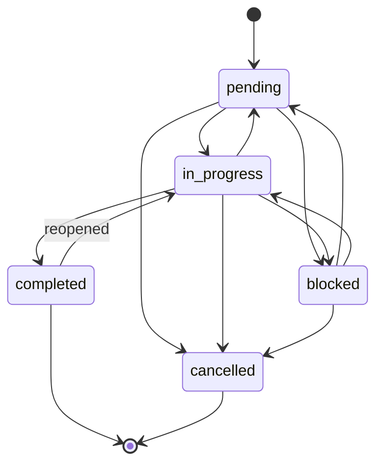

# State Machine Specification

This document defines the state machine for task states in the markdown plan compiler.

## States

| State | Description | Initial | Final |
|-------|-------------|---------|-------|
| `pending` | Task not yet started | Yes | No |
| `in-progress` | Task currently being worked on | No | No |
| `blocked` | Task blocked by dependencies or issues | No | No |
| `completed` | Task finished successfully | No | Yes |
| `cancelled` | Task no longer needed | No | Yes |

## State Transitions



## Transition Table

| From State | Allowed To States |
|------------|-------------------|
| `pending`  | `in-progress`, `blocked`, `cancelled` |
| `in-progress` | `completed`, `blocked`, `pending`, `cancelled` |
| `blocked`   | `pending`, `in-progress`, `cancelled` |
| `completed` | `in-progress` (reopening allowed) |
| `cancelled` | (none - terminal state) |

## Validation Rules

### Dependency Completion Rule
A task cannot be set to `in-progress` if any of its dependencies are not in `completed` or `cancelled` state.

### Subtask Completion Rule
A task cannot be set to `completed` if it has any subtasks that are not in `completed` or `cancelled` state.

## State Machine Definition Format (YAML)

The compiler will load state machine definitions from YAML files with the following structure:

```yaml
name: task-state-machine
version: 1.0

states:
  pending:
    description: Task not yet started
    initial: true
    transitions:
      - to: in-progress
      - to: blocked
      - to: cancelled

  in-progress:
    description: Task currently being worked on
    transitions:
      - to: completed
      - to: blocked
      - to: pending
      - to: cancelled

  blocked:
    description: Task blocked by dependencies or issues
    transitions:
      - to: pending
      - to: in-progress
      - to: cancelled

  completed:
    description: Task finished successfully
    final: true
    transitions:
      - to: in-progress  # Allow reopening if issues found

  cancelled:
    description: Task no longer needed
    final: true
    transitions: []  # No transitions out of cancelled

rules:
  dependency_completion:
    when: in-progress
    requires: all_dependencies_completed_or_cancelled

  subtask_completion:
    when: completed
    requires: all_subtasks_completed_or_cancelled
